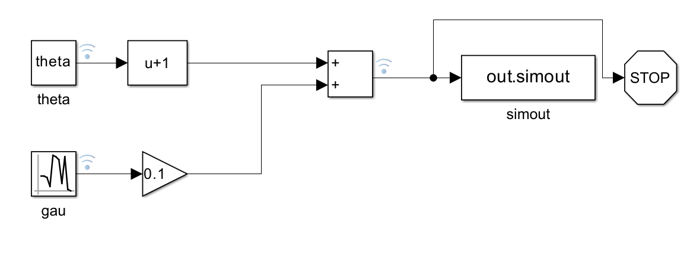

# Simulation-Based Inference with Simulink

## Introduction

Simulation-Based Inference (SBI) is an emerging field that leverages the power of simulations to perform inference in complex models. This approach has gained significant traction due to its ability to handle high-dimensional, non-linear, and stochastic models that are often encountered in real-world applications. Simulink, a powerful simulation environment developed by MathWorks, has proven to be an invaluable tool in the real-world modeling field. This repository aims to bridge the gap between the SBI library and Simulink simulations, enabling both runtime and offline interaction with Simulink models for SBI tasks.


[Learn more about SBI from this amazing blog](https://transferlab.ai/series/simulation-based-inference)

## Overview

This repository replicates the notebooks from the [SBI library](https://github.com/sbi-dev/sbi/blob/main/tutorials) but adapts them to use Simulink simulations. The primary goal is to demonstrate how Simulink can be effectively integrated with SBI for practical applications. The repository is structured to provide a comprehensive understanding of how to interface with Simulink using the [`Matlab2Py`](https://github.com/Spinkoo/Matlab2Py) library, which is being developed alongside this project.

## Getting Started

### Prerequisites

- MATLAB (R2019b or later)
- Simulink
- Python (3.6 or later)
- `matlab2py` library (in development)

### Installation

1. Clone this repository to your local machine.
2. Install the `matlab2py` library by following the instructions provided in the library's documentation.
3. Ensure that MATLAB and Simulink are correctly installed and configured on your system.

**NOTE for your matlabengine you need to install matlabengine<=9.14.6 and for scipy you might need scipy<=1.11.2**

## Usage

The repository contains a series of notebooks that demonstrate various SBI tasks using Simulink simulations. Each notebook is designed to be self-contained, providing step-by-step instructions on how to set up and run the simulation, as well as how to perform inference using the SBI library.

### Running a Notebook

1. Run the notebook by double-clicking on its name.
2. Follow the instructions within the notebook to execute the simulation and perform inference.

**NOTE that this example used here is minimal and considered computationally expensive but it's used only for the sake of illustration & maintaining the coherence with SBI API**
```
def simulator(theta):
    # linear gaussian
    return theta + 1.0 + torch.randn_like(theta) * 0.1
```
<p align="center"></p>

**The pipeline can be used with various types of more complex simulations**

## Contributing

Contributions to this repository are welcome. If you have suggestions for improvements or additional notebooks, please open an issue or submit a pull request.

## License

This project is licensed under the AGPL-3.0 license License. See the [LICENSE](LICENSE) file for details.

## Acknowledgments

- The SBI library for providing a robust framework for simulation-based inference.
- MathWorks for developing Simulink, a powerful tool for simulation and model-based design.
- The open-source community for their continuous support and collaboration.
- This work was supported by the French National Research Agency under the France 2030 program project IRT Nanoelec (ANR-10-AIRT-05).

## Contact

For any questions or feedback, please contact the repository maintainer.